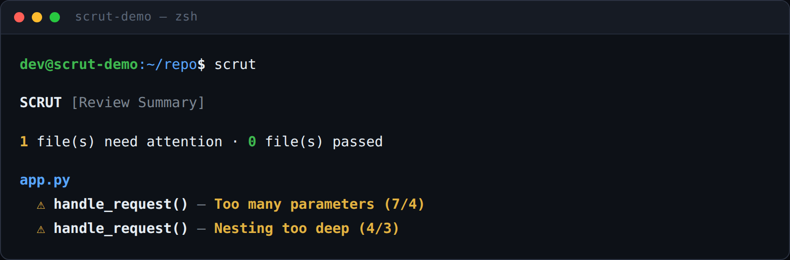
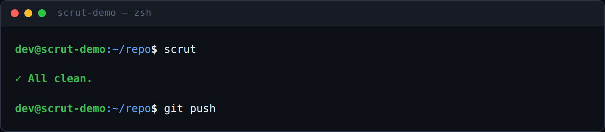
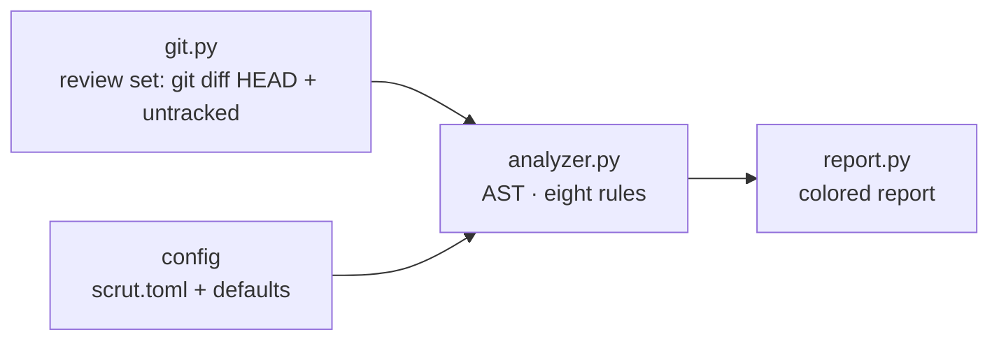

# scrut

**Review the Python you changed, not the Python you inherited.**

Scrut is a zero-dependency CLI that reviews exactly the files your next
commit will touch. It asks Git what changed, parses each changed `.py` file
with the standard `ast` module, and reports structural problems against
limits you set in `scrut.toml`. No daemon. No network. No path lists to
maintain. Run it in the seconds before `git push`, fix what it flags, push.

```bash
pip install scrut
cd your-repo
scrut
```

---

## Project philosophy

Scrut is built on five invariants. They are not features; they are the
reasons the tool exists, and every design decision in the codebase
reinforces them.

**1. The review set is the diff, not the repository.**
A whole-repo linter reports pre-existing debt and buries the findings you
just introduced under hundreds you didn't. Scrut computes its review set
from Git at run time (`git diff HEAD --name-only` plus untracked files)
and never asks you to configure it. Every finding in the output is
attributable to work you are about to push. The tool reviews your commit,
not your legacy.

**2. Metrics are exact, or they don't ship.**
Structural questions are answered by the Python abstract syntax tree:
parameter counts, nesting depth, line spans. Regex cannot count parentheses
across lines, measure nesting, or tell a definition from a call. If a metric
cannot be computed exactly from the AST, scrut does not claim it.

**3. Errors are data, not exceptions.**
An unreadable or syntactically broken file becomes an `ERROR` entry in the
report. The run over N files always yields N file reports, and one broken
file never cancels the review of the others.

**4. Scrut reviews; it does not gate.**
The exit code is always 0. Enforcement belongs in an explicit, opt-in
interface (CI output and exit codes are on the roadmap), not in the default
behavior of a tool you run before every push.

**5. Zero dependencies is a feature.**
Two `git` subprocess calls and the standard library. No lockfile to update,
no supply chain to audit, no daemon to keep alive. Runtime is bounded by
the size of your diff, not your repository.

---

## Installation

Requires **Python 3.10+** (the rules use `ast.Match`; configuration uses
`tomllib`) and **Git on `PATH`**. No other dependencies exist or are
installed.

```bash
pip install scrut
```

or from source:

```bash
git clone https://github.com/mukundzha/scrut.git
cd scrut
pip install -e .
```

Both register the `scrut` console script (`scrut.cli:main`).

---

## Usage

The entire interface is one command with no arguments and no flags:

```bash
cd your-repo
# ... make a change ...
scrut
```

No arguments is a property, not a limitation: the review set is defined by
Git, so there is nothing to configure at invocation time.

### A run with findings

```bash
dev@scrut-demo:~/repo$ scrut
```



```text
SCRUT [Review Summary] — 1 file(s) need attention

app.py
  ⚠ handle_request() — Too many parameters (7/4)
  ⚠ handle_request() — Nesting too deep (4/3)
```

### A clean run

```bash
dev@scrut-demo:~/repo$ scrut
```



```text
✓ All clean.
```

### Edge cases

```text
$ cd /tmp/somewhere-without-git
$ scrut
Not inside a Git repository.

$ cd ~/repo-with-no-python-changes
$ scrut
No Python files to review.
```

Colors are ANSI codes emitted only when stdout is a TTY. Piped output is
plain, so `scrut | tee review.log` and CI capture work cleanly.

---

## Configuration

Configuration is optional, partial, and declarative. Scrut looks for a
`scrut.toml` file in the current working directory and merges it over the
defaults:

| Key | Default | Repo's own |
|---|---|---|
| `max_parameters` | 5 | 4 |
| `max_nesting` | 4 | 5 |
| `max_function_lines` | 50 | 50 |
| `max_class_lines` | 200 | 50 |
| `max_file_lines` | 400 | 50 |
| `max_complexity` | 10 | 10 |
| `max_boolean_conditions` | 5 | 5 |

```toml
# scrut.toml — any subset is valid
[limits]
max_parameters = 3
max_nesting    = 4
```

`merge_limits()` copies the defaults and overlays your keys, so a single
line is a complete, valid configuration. This repository lives by its own
file, `scrut.toml` at the root:

```toml
[limits]
max_parameters      = 4
max_nesting         = 5
max_function_lines  = 50
max_class_lines     = 50
max_file_lines      = 50
max_complexity      = 10
```

Two documented constraints: the file is resolved from the current working
directory only (upward search is on the roadmap), and a malformed file
raises rather than being silently ignored.

---

## Rules: what scrut checks

Eight rules, each emitting a `WARNING`. All but the bare-except rule embed
the measured value and the limit, so every line of the report is
self-explanatory without context:

| Rule | Message format | Default |
|---|---|---|
| Function length | `Function too long (N/limit)` | 50 lines |
| Parameter count | `Too many parameters (N/limit)` | 5 |
| Nesting depth | `Nesting too deep (N/limit)` | 4 levels |
| Class size | `Class too large (N/limit)` | 200 lines |
| File size | `File too large (N/limit)` | 400 lines |
| Complexity | `Function too complex (N/limit)` | 10 |
| Boolean complexity | `Boolean expression too complex (N/limit)` | 5 |
| Bare except | `Bare except catches every exception. Catch a specific exception instead.` | none |

### Complexity: McCabe cyclomatic

`calculate_complexity()` counts decision points the way McCabe intended:
base 1, then +1 for every `if`/`elif`, ternary, `for`, `while`, `with`,
`assert`, `try`, each `except` handler, each `match`, and each `and`/`or`
chain. The count is a walk over the whole subtree: decisions inside a
nested function count toward the enclosing one, and a class's complexity
is the sum over its entire body, methods included — `Class too complex`
fires when the whole class is over the limit.

### Boolean expressions: operand count per chain

`count_boolean_conditions()` measures a single `and`/`or` chain: every
operand contributes 1 and nested chains sum their operands, so `a and b`
scores 2 and `a and (b or c)` scores 3. `Boolean expression too complex
(N/limit)` fires when any chain exceeds `max_boolean_conditions` (default
5). Functions and classes are both checked.

### Bare except

`analyze_bare_except()` walks a function and flags every `except:` handler
that catches nothing specific. There is no limit to configure: the rule is
binary and applies to every function, including methods.

### Nesting: maximum depth, not block count

`get_depth()` is a recursive maximum over the tree. A node adds a level
only if it is one of the eight `BLOCK_NODES`:

```
If · For · While · AsyncFor · With · AsyncWith · Try · Match
```

Comprehensions, lambdas, and nested `def` statements do **not** add depth,
and sibling blocks do not stack. The metric is maximum nesting depth, not
block count: a 4-deep comprehension chain is data transformation, not
tangled control flow.

### Parameters: positional and keyword arguments only

The count is `len(node.args.args)`. `*args`, `**kwargs`, keyword-only
parameters, and `self` are excluded — the rule measures the arguments that
make a call hard to read, not the signature's machinery.

### Error containment

A file that cannot be read or parsed becomes an `ERROR` entry (`Could not
read file`, `Python syntax error`) while the run continues. `ERROR`
findings render with a red `✖`; warnings with a yellow `⚠`.

---

## Architecture

The codebase is deliberately small: nine modules, one entry point, no
dependencies. The governing rule is that **`cli.py` only orchestrates** —
every function it calls lives in another module, and nothing imports
`cli.py`. That is what keeps all 34 tests fast and mock-light.



| Module | Role | Exports |
|---|---|---|
| `cli.py` | Pipeline wiring | `main()` |
| `git.py` | Git interaction | `is_gitrepo`, `get_changed_files`, `get_reviewable_files` |
| `analyzer.py` | AST analysis | `BLOCK_NODES`, `read_file`, `get_depth`, `analyze_file` |
| `rules/complexity.py` | Cyclomatic complexity | `calculate_complexity` |
| `rules/boolean_complexity.py` | Boolean-chain measurement | `analyze`, `count_boolean_conditions` |
| `rules/bare_except.py` | Bare-except detection | `analyze` |
| `report.py` | Output rendering | `render_report`, `generate_report` |
| `config/default.py` | Default limits | `DEFAULT_LIMITS` |
| `config/loader.py` | TOML loading + merge | `load_config`, `merge_limits` |

### Repository layout

```
scrut/
├── pyproject.toml          # packaging, entry point, pytest config
├── scrut.toml              # limits this repo lives by
├── cx-demo/                # scratch demos for end-to-end runs
├── src/scrut/
│   ├── cli.py              # entry point; orchestration only
│   ├── git.py              # is_gitrepo, get_changed_files, get_reviewable_files
│   ├── analyzer.py         # BLOCK_NODES, read_file, get_depth, analyze_file
│   ├── rules/
│   │   ├── complexity.py        # calculate_complexity (McCabe)
│   │   ├── boolean_complexity.py  # analyze, count_boolean_conditions
│   │   └── bare_except.py       # analyze
│   ├── report.py           # render_report, generate_report
│   └── config/
│       ├── default.py      # DEFAULT_LIMITS
│       └── loader.py       # load_config, merge_limits
└── tests/
    └── test_git.py         # 34 tests
```

---

## Contributing

### Setup

```bash
git clone https://github.com/mukundzha/scrut.git
cd scrut
pip install -e .
python -m pytest tests/
```

### The test suite

All 34 tests run in a fraction of a second, with no network and no package
installs; 32 pass today. Two complexity tests still encode the previous
pruned traversal (nested `def`s excluded, one point per `match` case) and
await realignment with the current walk-based metric. Coverage includes
the git helpers, config merging, all eight nesting block types, every
complexity decision point, boolean-chain measurement, bare-except
detection, every analysis failure path, report output, and an end-to-end
run against a **real temporary git repository** — Git itself is not
mocked. Mocking is limited to `subprocess.run` where a real Git isn't
needed.

### Conventions

- **Tests before code.** A fix that cannot be expressed as a failing test
  first is not a fix yet.
- **Keep the diff small.** This codebase has nine modules for a reason.
  A change that touches more than two of them needs a justification in the
  PR description.
- **Zero dependencies is the contract.** No new runtime dependencies
  without a written case that survives the philosophy section of this
  README.
- **The README is the spec.** If the behavior changed, the README changes
  in the same commit.

### Adding a rule

A rule is a few lines inside the `analyze_file` walk plus a default in
`DEFAULT_LIMITS` (or a `scrut.toml` key). Rules with real measurement
logic live in `scrut/rules/` behind an `analyze(node, limits)` signature —
cyclomatic complexity, boolean-chain measurement, and bare-except
detection all follow it. The renderer displays any `(severity, message)`
pair it receives, so no report code changes. Write the test first: one
for the violation, one for the boundary.

---

## Roadmap

Informed by the documented limitations, ordered by the pain they remove:

**0.2 — Configuration and review-set hardening**
- Validate `scrut.toml` values with readable errors (today: a malformed
  file raises)
- Search upward from the working directory for `scrut.toml` (today:
  CWD only)

**0.3 — Metric completeness**
- Count `*args`, `**kwargs`, and keyword-only parameters
- Analyze `AsyncFunctionDef` (today: skipped)

**1.0 — CI-grade interface**
- `--json` output for tooling
- Configurable exit codes, so enforcement is possible without changing
  scrut's review-only default

The rule ceiling is raised deliberately, not by accretion; each new rule
must survive the philosophy section.

---

## FAQ

**Why only changed files?**
Pre-existing issues are noise. A whole-repo run buries the few findings you
introduced under hundreds you didn't. The review set is the diff, so the
output is always relevant to the next push.

**Why `git diff HEAD` and not `git diff`?**
Plain `git diff` covers only unstaged changes. `HEAD` covers staged plus
unstaged — the complete set of files about to be pushed — and scrut adds
untracked files on top, so brand-new files are never missed.

**Why AST instead of regex?**
Regex cannot count parentheses across lines, measure nesting, or distinguish
a definition from a call. The AST answers structural questions exactly for
every valid Python file.

**Why always exit 0?**
Scrut is a reviewer, not a gate. CI enforcement belongs in an explicit
feature (`--json`, configurable exit codes — see Roadmap), not in the
default behavior.

**Does it need a network or a daemon?**
No. Two `git` subprocess calls and the standard library. Runtime is bounded
by the size of your diff, not your repository.

---

## License

MIT — see `LICENSE`.
