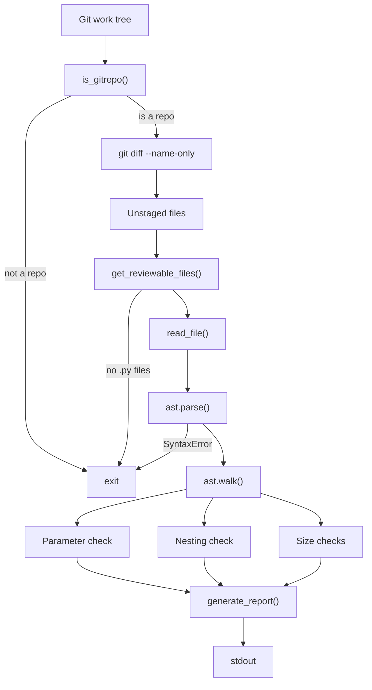

# Scrut

AST-based static analysis for unstaged Python changes.

---

## Table of Contents

- [What is Scrut?](#what-is-scrut)
- [Why AST?](#why-ast)
- [Features](#features)
- [Architecture](#architecture)
- [Repository Layout](#repository-layout)
- [Installation](#installation)
- [Quick Start](#quick-start)
- [Example Output](#example-output)
- [Review Rules](#review-rules)
- [Running Tests](#running-tests)
- [Development](#development)
- [Current Limitations](#current-limitations)
- [Roadmap](#roadmap)
- [Contributing](#contributing)
- [License](#license)

---

## What is Scrut?

Scrut is a CLI tool that analyzes unstaged changes in Git repositories. It
parses changed Python files with `ast.parse`, checks four structural rules, and
prints a formatted report — zero dependencies beyond Python 3.10+ and Git.

No configuration files. No plugins. No network access.

It is for Python developers who want lightweight, offline feedback on code
structure before opening a pull request.

---

## Why AST?

Most review tools use regex to detect code issues. Regex cannot reliably match
multi-line function signatures, measure nesting depth, or distinguish
definitions from calls.

Python's `ast` module parses source into a syntax tree. From the tree, Scrut
reads:

- **Parameter count** — `len(node.args.args)`
- **Nesting depth** — recursive walk counting only `For`, `If`, and `While` nodes
- **Line counts** — `end_lineno - lineno`

The tree structure guarantees correct results for every valid Python file.
There are no false positives from comment strings, no missed multi-line
signatures, no fragile patterns.

---

## Features

- **Git context detection** — exits cleanly when not inside a Git work tree
- **Unstaged file collection** — reads `git diff --name-only` for changed files
- **`.py` file filtering** — only analyzes files with `.py` extension that exist on disk
- **AST parsing** — uses Python's standard `ast.parse` for all analysis
- **Parameter threshold** — warns when a function exceeds 5 parameters
- **Nesting threshold** — warns when `for`/`if`/`while` blocks exceed 4 levels
- **File size threshold** — warns when a file exceeds 400 lines
- **Class size threshold** — warns when a class exceeds 200 lines
- **Formatted report** — structured summary with per-function and per-class breakdowns

---

## Architecture

Scrut runs as a single synchronous pipeline. No caching, no async, no external
services.



Every invocation starts from scratch.

---

## Repository Layout

```
scrut/
├── pyproject.toml      # Packaging, metadata, pytest config
├── LICENSE              # MIT
├── README.md
├── src/
│   └── scrut/
│       ├── __init__.py  # Package marker (empty)
│       └── cli.py       # Entire pipeline: 233 lines
├── tests/
│   └── test_git.py      # 7 unit tests: 113 lines
└── dist/                # Built wheel and source distribution
```

The entire implementation lives in a single module: `src/scrut/cli.py`. It
contains Git integration, file filtering, AST parsing, rule checking, and
report generation — all in one file.

The test file is named `test_git.py` for historical reasons. It imports from
`scrut.cli`.

---

## Installation

Requires **Python 3.10+** and **Git 2.0+**. No other dependencies.

### PyPI

```bash
pip install scrut
```

### Source

```bash
git clone https://github.com/mukundzha/scrut.git
cd scrut
pip install .
```

### Development

```bash
git clone https://github.com/mukundzha/scrut.git
cd scrut
pip install -e .
```

The `pyproject.toml` registers a CLI entry point:

```toml
[project.scripts]
scrut = "scrut.cli:main"
```

After installation, the `scrut` command is available on your PATH.

---

## Quick Start

```bash
cd /path/to/your/python/project
# Make unstaged changes to a .py file
scrut
```

Scrut runs this pipeline:

1. Calls `git rev-parse --is-inside-work-tree` — exits if not a Git repo
2. Runs `git diff --name-only` to collect unstaged changed files
3. Filters to `.py` files that exist on disk
4. Reads the first matching file
5. Parses it with `ast.parse`
6. Walks the AST for `FunctionDef` and `ClassDef` nodes
7. Checks each node against four rule thresholds
8. Prints a formatted report to stdout

> **Note:** Only the first changed Python file is analyzed. The report always
> shows exactly one file.

---

## Example Output

Running against a file that triggers all four rules:

```
==================================================
SCRUT REPORT
==================================================

FILE
--------------------------------------------------
Name   : src/handler.py
Lines  : 500
Issues:
  [WARNING] File too large (500/400)

FUNCTIONS
--------------------------------------------------

Function 1: process_user_data
Lines         : 45
Parameters    : 12
Nesting Depth : 6
Issues:
  [WARNING] Too many parameters (12/5)
  [WARNING] Nesting too deep (6/4)

Function 2: normalize_email
Lines         : 8
Parameters    : 1
Nesting Depth : 0
Issues: None

CLASSES
--------------------------------------------------
No classes found.

==================================================
SUMMARY
==================================================
Functions Reviewed : 2
Classes Reviewed   : 0
Files Reviewed     : 1
Issues Found       : 3
==================================================
```

### Error messages

| Scenario | Output |
|---|---|
| Not in a Git repo | `Not inside a Git repository.` |
| No changed Python files | `No Python files to review.` |
| Python syntax error | `Python syntax error.` |
| File not readable | `Couldn't read <path>` |

The tool always exits with code 0, regardless of issues found.

---

## Review Rules

All thresholds are module-level constants in `src/scrut/cli.py`:

```python
PARAMETER_LIMIT = 5
NESTING_LIMIT = 4
FILE_LINE_LIMIT = 400
CLASS_LINE_LIMIT = 200
```

| Rule | Threshold | Severity | Description |
|---|---|---|---|
| Maximum parameters | >5 | WARNING | Function has more arguments than allowed |
| Maximum nesting depth | >4 | WARNING | `for`/`if`/`while` blocks nested deeper than 4 levels |
| Maximum file size | >400 lines | WARNING | Source file exceeds the line count limit |
| Maximum class size | >200 lines | WARNING | Class definition exceeds the line count limit |

All issues carry `WARNING` severity. There is no `ERROR` level.

### Nesting depth

Only `ast.For`, `ast.If`, and `ast.While` nodes increase the depth counter.
`Try`, `With`, `AsyncFor`, and `AsyncWith` are excluded — the metric targets
conditional and loop complexity, not general block nesting.

```python
def get_depth(node, depth=0):
    max_depth = depth
    for child in ast.iter_child_nodes(node):
        if isinstance(child, (ast.For, ast.If, ast.While)):
            max_depth = max(max_depth, get_depth(child, depth + 1))
        else:
            max_depth = max(max_depth, get_depth(child, depth))
    return max_depth
```

---

## Running Tests

Tests use **pytest** with `unittest.mock` for subprocess isolation and
`tmp_path` for filesystem operations.

```bash
pytest -v
```

Expected output:

```
tests/test_git.py::test_get_reviewable_files PASSED
tests/test_git.py::test_get_depth_no_nesting PASSED
tests/test_git.py::test_get_depth_nested PASSED
tests/test_git.py::test_read_file PASSED
tests/test_git.py::test_get_changed_files PASSED
tests/test_git.py::test_is_gitrepo_true PASSED
tests/test_git.py::test_is_gitrepo_false PASSED
```

| Test | What it validates |
|---|---|
| `test_get_reviewable_files` | Only `.py` files that exist on disk pass the filter |
| `test_get_depth_no_nesting` | A flat function returns depth 0 |
| `test_get_depth_nested` | `if > while > for` returns depth 3 |
| `test_read_file` | Reads file contents correctly using `tmp_path` |
| `test_get_changed_files` | Mocks `subprocess.run`, parses stdout into a list |
| `test_is_gitrepo_true` | Returns `True` when `git rev-parse` exits 0 |
| `test_is_gitrepo_false` | Returns `False` when `git rev-parse` exits 1 |

pytest configuration in `pyproject.toml`:

```toml
[tool.pytest.ini_options]
testpaths = ["tests"]
pythonpath = ["src"]
```

The `pythonpath` setting adds `src/` to `sys.path` so
`from scrut.cli import ...` resolves during collection.

---

## Development

### Editable install

```bash
pip install -e .
```

### Build

```bash
python -m build
```

### Package

Build artifacts land in `dist/`:

```
dist/
├── scrut-0.1.1-py3-none-any.whl
└── scrut-0.1.1.tar.gz
```

### Publish to PyPI

```bash
twine upload dist/*
```

### Release checklist

1. Bump version in `pyproject.toml`
2. Run `pytest`
3. Build: `python -m build`
4. Publish: `twine upload dist/*`

---

## Current Limitations

- **Single-file review** — only the first changed Python file is analyzed
  (`reviewable_files[0]` in `main()`)
- **Unstaged changes only** — `git diff --name-only` does not return staged
  or committed files
- **No exit code signaling** — the tool always exits 0, even when issues
  are found
- **No configuration** — thresholds are hardcoded; no config file,
  environment variables, or CLI flags
- **Plain text output only** — no JSON, SARIF, or other machine-readable
  formats
- **No rule plugin system** — adding a new rule means editing `cli.py`
  directly

---

## Roadmap

- Review all changed files instead of only the first one
- Support staged files (`git diff --cached`)
- Add JSON output for CI integration
- Make rules configurable via `pyproject.toml`
- Expand rule set (unused imports, bare except clauses, missing docstrings)
- Add pre-commit hook support

---

## Contributing

The codebase is a single 233-line module and one 113-line test file.

Good starting points:

- `generate_report()` has no dedicated test
- Multi-file iteration in `main()` is the most requested fix
- A new rule can be added by extending the AST walk loop in `main()`

Run `pytest` before submitting changes.

---

## License

MIT. See `LICENSE`.
