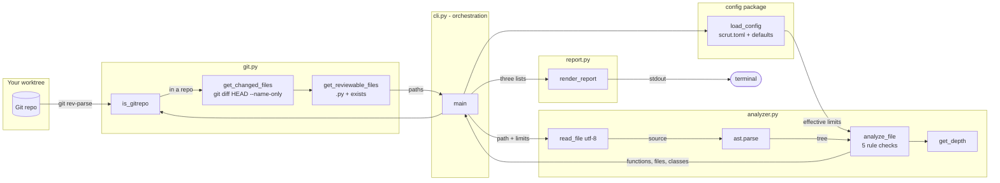
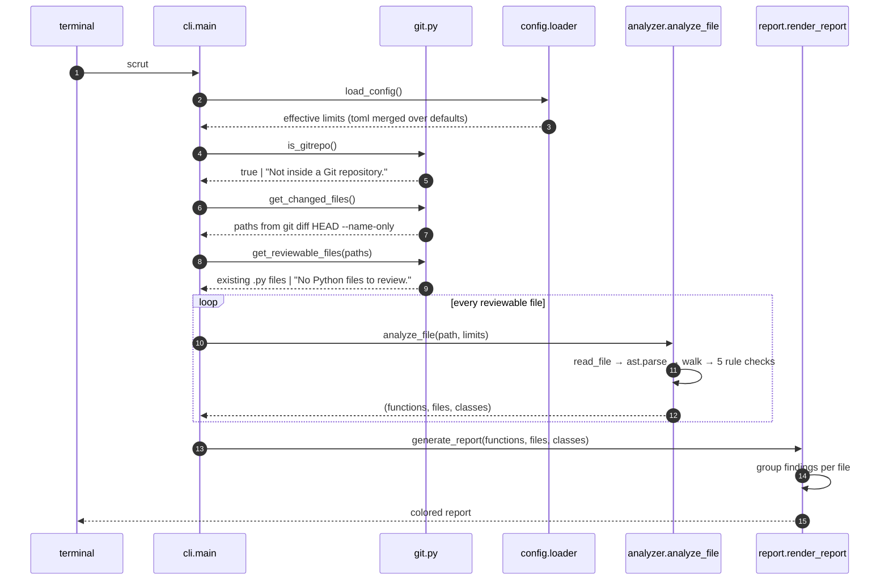
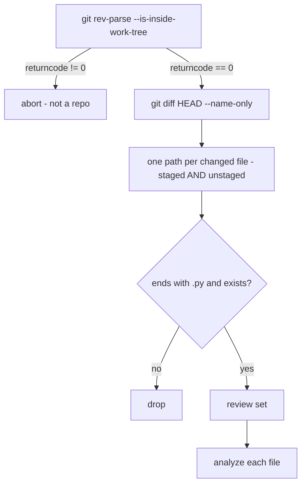
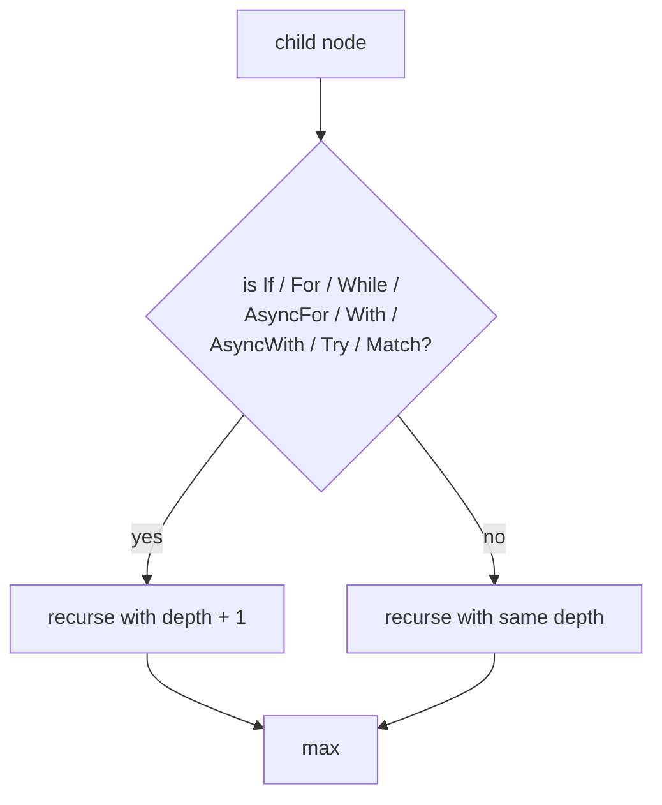
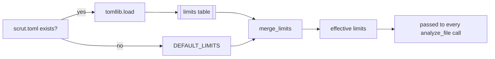
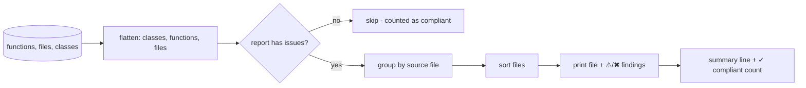

# scrut

**Review the Python you changed — not the Python you inherited.**

Scrut is a zero-dependency CLI that reviews exactly the files your next
commit will touch. It asks Git what changed, parses each changed `.py` file
with the standard `ast` module, and reports structural problems against
limits you set in `scrut.toml`. No daemon. No network. No configuration
files listing paths. Run it in the seconds before `git push`.

---

## The big picture



One rule governs the whole architecture: **`cli.py` only orchestrates.**
Every function it calls lives in `git.py`, `analyzer.py`, or `report.py`,
and dependencies point strictly downward — nothing imports `cli.py`. That
is what keeps all 22 tests fast and mock-light.

| Module | Role | Exports |
|---|---|---|
| `cli.py` | Pipeline wiring | `main()` |
| `git.py` | Git interaction | `is_gitrepo`, `get_changed_files`, `get_reviewable_files` |
| `analyzer.py` | AST analysis | `BLOCK_NODES`, `read_file`, `get_depth`, `analyze_file` |
| `report.py` | Output rendering | `render_report`, `generate_report` |
| `config/default.py` | Default limits | `DEFAULT_LIMITS` |
| `config/loader.py` | TOML loading + merge | `load_config`, `merge_limits` |

---

## Anatomy of a run



Failure is contained per file. An unreadable or syntactically broken file
becomes an `ERROR` entry in the report — the loop keeps going, and a run
over N files always yields N file reports. The exit code is always 0:
scrut reports, it doesn't gate.

---

## The Git side: computing the review set



Why `HEAD`? Plain `git diff` sees only unstaged work. `git diff HEAD`
captures **staged + unstaged** — exactly the files that will land in your
next push. One consequence, documented in Limitations: untracked files are
invisible to `git diff HEAD` and never reviewed.

---

## The analyzer: five rules over one tree

```mermaid
flowchart TD
    A[source code] --> B[read_file utf-8]
    B -->|OSError| E1[ERROR: Could not read file]
    B -->|source| C[ast.parse]
    C -->|SyntaxError| E2[ERROR: Python syntax error]
    C -->|tree| D[ast.walk]
    D --> F[FunctionDef]
    D --> G[ClassDef]
    F --> H[lines = end_lineno - lineno + 1]
    F --> I[params = len args.args]
    F --> J[get_depth]
    H --> K{lines > max_function_lines?}
    I --> L{params > max_parameters?}
    J --> M{depth > max_nesting?}
    G --> N{lines > max_class_lines?}
    K -->|yes| W1[Function too long (N/limit)]
    L -->|yes| W2[Too many parameters (N/limit)]
    M -->|yes| W3[Nesting too deep (N/limit)]
    N -->|yes| W4[Class too large (N/limit)]
    W1 & W2 & W3 --> O[function report]
    W4 --> P[class report]
    O & P --> Q[file too large check]
    Q --> R[(functions, files, classes)]
```

| Rule | Message | Default | In `scrut.toml` |
|---|---|---|---|
| Function length | `Function too long (N/limit)` | 50 | 50 |
| Parameter count | `Too many parameters (N/limit)` | 5 | 4 |
| Nesting depth | `Nesting too deep (N/limit)` | 4 | 5 |
| Class size | `Class too large (N/limit)` | 200 | 50 |
| File size | `File too large (N/limit)` | 400 | 50 |

Every message embeds the measured value and the limit, so each line of the
report is self-explanatory without context.

### How nesting is measured

`get_depth()` is a recursive maximum over the tree. A node adds a level only
if it is one of the eight `BLOCK_NODES`:



Comprehensions, lambdas, and nested `def` statements do **not** add depth;
sibling blocks do not stack. The metric is maximum depth, not block count —
a 4-deep comprehension chain is data transformation, not tangled control
flow.

---

## Configuration: merge, don't validate



```toml
[limits]
max_parameters    = 5
max_nesting       = 4
max_function_lines = 50
max_class_lines   = 200
max_file_lines    = 400
```

Configuration is optional and partial by design: `merge_limits()` copies the
defaults and overlays your keys, so `[limits] max_parameters = 3` alone is a
complete, valid configuration. The file is resolved from the current working
directory only — documented in Limitations.

---

## The report

Findings are grouped per file — the analyzer deliberately returns flat
lists, and the renderer rebuilds the grouping at display time:



```
SCRUT [Review Summary]

2 file(s) need attention · 0 file(s) passed

src/scrut/report.py
  ⚠ render_report() — Function too long (53/50)
  ⚠ file — File too large (70/50)
tests/test_git.py
  ⚠ file — File too large (310/50)

✓ 0 compliant files hidden
```

`⚠` marks warnings, `✖` marks errors. Colors are ANSI codes emitted only
when stdout is a TTY — piped output is plain, so `scrut | tee log` and CI
capture work cleanly.

---

## Installation

Requires **Python 3.10+** (rules use `ast.Match`, config uses `tomllib`)
and **Git on `PATH`**. No other dependencies exist or are installed.

```bash
pip install scrut
```

or from source:

```bash
git clone https://github.com/mukundzha/scrut.git
cd scrut
pip install -e .
```

Both register the `scrut` console script (`scrut.cli:main`).

## Quick start

```bash
cd your-repo
# make a change
scrut
```

No arguments, no flags. That is the entire interface — a property, not a
limitation: the review set is defined by Git, so there is nothing to
configure at invocation time.

## Repository layout

```
scrut/
├── pyproject.toml          # packaging, entry point, pytest config
├── scrut.toml              # limits this repo lives by
├── src/scrut/
│   ├── cli.py              # entry point; orchestration only
│   ├── git.py              # is_gitrepo, get_changed_files, get_reviewable_files
│   ├── analyzer.py         # BLOCK_NODES, read_file, get_depth, analyze_file
│   ├── report.py           # render_report, generate_report
│   └── config/
│       ├── default.py      # DEFAULT_LIMITS
│       └── loader.py       # load_config, merge_limits
└── tests/
    └── test_git.py         # 22 tests
```

## Development

```bash
python -m pytest tests/
```

The suite covers the git helpers, config merging, all eight nesting block
types, every analysis failure path, report output, and an end-to-end run
against a **real temporary git repository** (git itself is not mocked).
Mocking is limited to `subprocess.run` where a real git isn't needed.

Adding a new rule is a few lines inside the `analyze_file` walk plus a
default in `DEFAULT_LIMITS` — the renderer displays any
`(severity, message)` pair it receives.

## Roadmap

Informed by the documented limitations:

- Validate `scrut.toml` values with readable errors
- Review untracked files and repositories without commits
- Count `*args`, `**kwargs`, and keyword-only parameters
- Analyze `AsyncFunctionDef`
- Search upward for `scrut.toml`
- `--json` output and configurable exit codes for CI

## FAQ

**Why only changed files?**
Pre-existing issues are noise. A whole-repo run buries the few findings you
introduced under hundreds you didn't. The review set is the diff, so the
output is always relevant to the next push.

**Why `git diff HEAD` and not `git diff`?**
Plain `git diff` covers only unstaged changes. `HEAD` covers staged plus
unstaged — the complete set of files about to be pushed.

**Why AST instead of regex?**
Regex cannot count parentheses across lines, measure nesting, or distinguish
a definition from a call. The AST answers structural questions exactly for
every valid Python file.

**Why always exit 0?**
Scrut is a reviewer, not a gate. CI enforcement belongs in an explicit
feature (`--json`, configurable exit codes — see Roadmap), not in the
default behavior.

**Does it need a network or a daemon?**
No. Two `git` subprocess calls and the standard library. Runtime is bounded
by the size of your diff, not your repository.

## License

MIT — see `LICENSE`.
