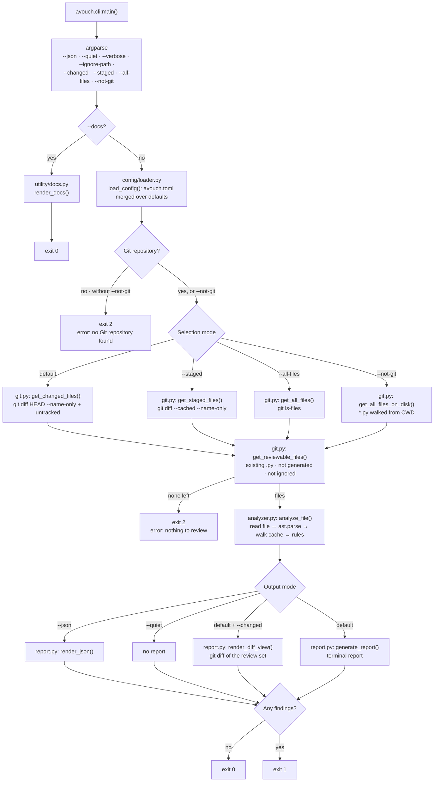
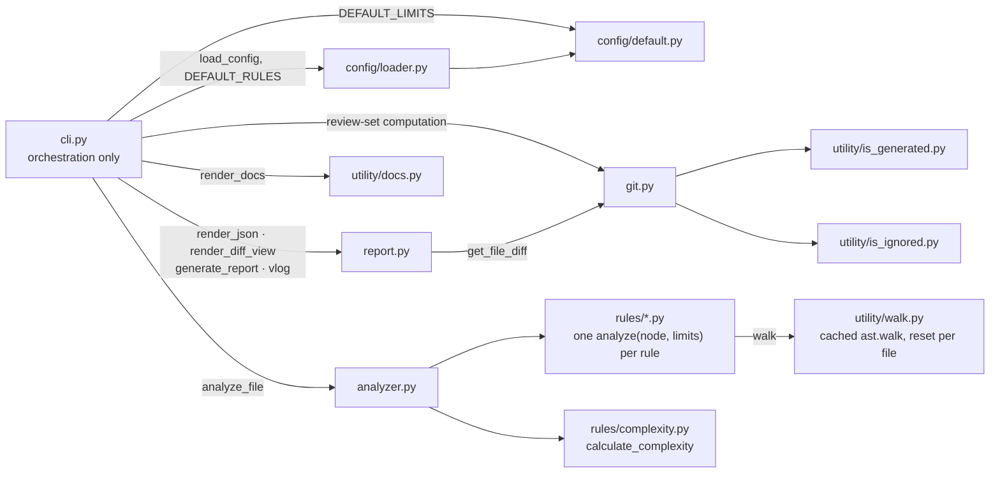

# avouch

**Review the Python you changed, not the Python you inherited.**

Avouch is a code reviewer for Python that only looks at the files your
next commit touches. It asks git for that list, parses each changed
`.py` file with the standard `ast` module, and reports structural
problems against limits you set in `avouch.toml`.

No daemon, no network, nothing to install alongside it. Run it in the
seconds before `git push`:

```bash
pip install avouch
cd your-repo
avouch
```

---

## Why I built this

Paid AI reviewers wasted half their report on legacy I never wrote and queued my diffs. I wanted a local, diff-only check that runs seconds before `git push` — so I built Avouch.


## Installation

Requires **Python 3.10+** (rules use `ast.Match`; configuration uses
`tomllib`) and **Git on `PATH`**.

```bash
pip install avouch
```

or from source:

```bash
git clone https://github.com/mukundzha/avouch.git
cd avouch
pip install -e .
```

Both register the `avouch` console script (`avouch.cli:main`).

---

## Quick start

Change a file, run it, read the report:

```text
$ avouch

AVOUCH · 2 FILES · 4 WARN
────────────────────────────────────────────────────────────────────────────────

bad.py:1: SCR002: Bare except detected. Catch a specific exception instead, e.g. except ValueError:.
  │
1 │ def connect(host, port, user, password, db, timeout):
  │     ^^^^^^^ SCR002
2 │     try:
  │

bad.py:1: SCR014: Too many parameters (6/5). Group related parameters into a data class or dictionary.
  │
1 │ def connect(host, port, user, password, db, timeout):
  │     ^^^^^^^ SCR014
2 │     try:
  │

────────────────────────────────────────────────────────────────────────────────
BY RULE

  SCR002 Bare except          1
  SCR014 Too many parameters  1

────────────────────────────────────────────────────────────────────────────────
PASSED
  ✓ src/util.py
```

Findings are compiler-style (`file:line` + caret) with a BY RULE tally and PASSING list. Duplicates `(component, rule)` collapse per file.

A clean run:

```text
$ avouch

All clean.
```

Flags:

```bash
avouch            # human report
avouch --json     # one JSON document on stdout
avouch --docs     # built-in documentation; no review performed
avouch --changed  # compact added/deleted view of changed files vs HEAD
avouch --staged   # review only files staged for the next commit
avouch --all-files  # review every eligible Python file, not just the diff
avouch --not-git  # review every eligible .py file on disk; no Git repo needed
avouch --quiet    # analyze, print no report; exit code only
avouch --verbose  # step-by-step review details on stderr
```

The review set is whatever git says is about to be pushed: files
modified vs `HEAD` plus untracked `.py` files. Deleted paths and
non-`.py` files are skipped; committed, untouched files never appear;
files that look generated (`generated.py`, `*_generated.py`, …) are
skipped too. The scope flags above are mutually exclusive.

Without a repository — or against a fresh CI checkout — there's
nothing to review:

```text
$ cd /tmp/somewhere-without-git
$ avouch
error: no Git repository found
hint: run Avouch from inside a Git repository, or use --not-git to review files without Git

$ cd ~/fresh-checkout
$ avouch
error: nothing to review
hint: nothing changed vs HEAD (CI checkouts are clean); use --all-files for a full review
```

Colors are ANSI, only when stdout is a TTY; piped output is plain, so
`avouch | tee review.log` and CI capture work cleanly. Errors go to
stderr. Exit codes: `0` clean, `1` findings, `2` couldn't run.

### Built-in documentation

`avouch --docs` prints terminal documentation derived from this codebase —
what Avouch does, the Git-aware workflow, every rule with its scope, every
configuration key with its default, both output formats, and realistic
examples — then exits `0` without running a review. It works anywhere,
even outside a Git repository. In a real terminal it opens as an
interactive browser (`H`elp, `G`o, `M`ain screen, `Q`uit); when stdout
is piped it prints the plain text instead.

---

## JSON output

For automation and CI, `--json` prints the review as a single JSON document
on stdout, with no human-readable text mixed in:

```bash
avouch --json
```

```json
{
  "version": 1,
  "tool": "avouch",
  "violations": [
    {
      "rule": "SCR014",
      "severity": "WARNING",
      "message": "Too many parameters (6/5). Group related parameters into a data class or dictionary.",
      "file": "buggy.py",
      "name": "extra",
      "kind": "func",
      "line": 4
    }
  ],
  "summary": {
    "total": 1,
    "errors": 0,
    "warnings": 1,
    "files_with_violations": 1
  }
}
```

Each violation has `rule` (or label), `severity`, `message`, `file`, `name`, `kind` (`func`/`class`/`file`), and `line` (`null` for file-level). `files_with_violations` counts distinct files.

Stable contract: `version` is schema version, `tool` identifies emitter. Deterministic JSON — no colors/timestamps. Same exit codes, so `avouch --json` can gate CI.

---

## Quiet mode

`--quiet` runs the exact same analysis but prints no report; only the
exit code signals the outcome (`0` clean, `1` violations, `2` Avouch
error), which makes it fit hooks and scripts that need only the status.
Errors are never silenced: messages such as "error: no Git repository found" still print, `--json` still emits its document, and
`--verbose` diagnostics still go to stderr.

---

## GitHub Actions

Avouch can run as a GitHub Actions check on every pull request and push.

### Add Avouch to your pipeline

For an existing project, a minimal workflow installs the published package
and reviews the whole checkout on every PR and push:

```yaml
name: Avouch

on:
  pull_request:
  push:

jobs:
  avouch:
    runs-on: ubuntu-latest
    permissions:
      contents: read

    steps:
      - uses: actions/checkout@v6

      - uses: actions/setup-python@v5
        with:
          python-version: "3.12"

      - name: Install Avouch
        run: python -m pip install avouch

      - name: Run Avouch
        run: avouch --all-files --json
```

- `checkout` provides the PR code; Avouch analyzes exactly that checkout.
- `setup-python` requires Python 3.10+.
- Pin `avouch==0.3.1` for reproducible runs; `permissions: contents: read` is enough.

### Why `--all-files`

The default review set is files changed vs. Git `HEAD`, so a freshly
checked-out working tree — clean by construction — has nothing to review:
`avouch` would print `error: nothing to review` and exit `2`. The same
applies to `--changed` and `--staged`; they only make sense locally,
against your own working tree. Whole-repository review is the mode that
works in CI:

| Command | Purpose | In CI |
|---------|---------|------|
| `avouch` | review files changed vs `HEAD` | empty set; don't use |
| `avouch --changed` | diff view of changed files | empty set; don't use |
| `avouch --staged` | review staged changes | empty set; don't use |
| `avouch --all-files` | review every eligible Python file | the CI mode |
| `avouch --json` | machine-readable document on stdout | combine with `--all-files` |
| `avouch --quiet` | suppress report; exit code only | fine for gating |

### Exit codes and failures

Avouch's exit code behaves in CI exactly as it does locally: `0` is clean,
`1` means findings were reported, `2` means Avouch could not run. GitHub
Actions fails a job when a step exits non-zero, so `--all-files --json`
fails the check on any finding, and the JSON document in the job log shows
why. Nothing is hidden with `|| true`; findings already present in the
repository fail the check until they are fixed or excluded with
`ignore_paths` in `avouch.toml`.

### The repository's own workflow

The Avouch repository itself ships `.github/workflows/avouch.yml`; enable it
in the repository's **Actions** tab and it runs on its own. It installs
the repository's own source with `pip install -e .`, so it tests the code
in the pull request rather than a published release, then reviews the
whole checked-out repository with `--all-files --json`.

---

## Pre-commit hook

Add Avouch to `pre-commit` so every commit reviews only what you're about to commit:

```yaml
# .pre-commit-config.yaml
repos:
  - repo: https://github.com/mukundzha/avouch
    rev: v0.3.2
    hooks:
      - id: avouch
```

Then:

```bash
pip install pre-commit
pre-commit install
```

`pass_filenames: false` — Avouch computes the review set itself via `git diff --cached`; no file list is passed twice. Baseline suppression (when configured) composes automatically; findings already baselined don't fail the hook. Use `git commit --no-verify` to bypass.

---

## Other CI systems

Avouch is a plain console command with a documented exit code, so any CI
system can run it with the same three steps:

1. Install: `python -m pip install avouch`
2. Run: `avouch --all-files --json`
3. Treat the exit code as the result: `0` pass, `1` findings, `2` error.

The JSON document on stdout is stable and versioned (see [JSON
output](#json-output)), so it can be parsed for job annotations, summary
comments, or dashboards.

---

## Configuration

Configuration is optional, partial, and declarative. Avouch looks for a
`avouch.toml` in the **current working directory** — no upward search, so
configuration is repository-local. Any subset of keys is merged over the
built-in defaults; a missing or empty file simply means defaults, with
no warning.

```toml
[limits]        # numeric thresholds per rule
[rules]         # on/off toggle per rule
ignore_paths = ["tests", "migrations"]   # top-level: paths to skip
```

### The configuration file

- **Name and format:** `avouch.toml` in your working directory, plain TOML.
- **Scope:** the current directory only. Avouch never searches parent
  directories, so each project configures itself.
- **Missing or empty:** defaults are used silently — there is no
  "no configuration found" warning.
- **Environment variables:** none. Configuration comes only from
  `avouch.toml` (the `AVOUCH_FONT` variable only selects a terminal font).

### Changing a threshold

List the limit you want under `[limits]`; only the keys you name change,
everything else stays at its default:

```toml
[limits]
max_parameters = 8    # allow up to 8 parameters instead of 5
max_file_lines = 2500 # tolerate larger files
```

### Disabling a rule

Put the rule under `[rules]` and set it to `false`:

```toml
[rules]
nested_function = false   # stop reporting SCR015
```

A one-line `[rules]` section is a complete, valid configuration.

### Rule toggles

| Key | Default | Rule |
|-----|---------|------|
| `async_without_await` | `true` | SCR001 |
| `bare_except` | `true` | SCR002 |
| `max_boolean_conditions` | `true` | SCR003 |
| `detect_duplicateb` | `true` | SCR004 |
| `max_large_comprehensions` | `true` | SCR005 |
| `empty_except` | `true` | SCR006 |
| `max_if_else_chain` | `true` | SCR007 |
| `max_lambda_nodes` | `true` | SCR008 |
| `max_local_variables` | `true` | SCR009 |
| `max_class_lines` | `true` | SCR010 |
| `max_file_lines` | `true` | SCR011 |
| `max_function_lines` | `true` | SCR012 |
| `max_nesting` | `true` | SCR013 |
| `max_parameters` | `true` | SCR014 |
| `nested_function` | `true` | SCR015 |
| `max_return_statements` | `true` | SCR016 |
| `mutable_default_args` | `true` | SCR017 |
| `max_complexity` | `true` | function/class complexity |

Setting a toggle to `false` disables that rule's findings.

### Limits

| Key | Default | Rule | Meaning |
|-----|---------|------|---------|
| `max_parameters` | 5 | SCR014 | Max positional + keyword params |
| `max_nesting` | 5 | SCR013 | Max block nesting depth |
| `max_function_lines` | 300 | SCR012 | Max function line span |
| `max_class_lines` | 200 | SCR010 | Max class line span |
| `max_file_lines` | 1000 | SCR011 | Max file line count |
| `max_complexity` | 40 | — | Max cyclomatic complexity |
| `max_boolean_conditions` | 5 | SCR003 | Max operands in one chain |
| `max_if_chain` | 5 | SCR007 | Max if/elif links in a chain |
| `max_local_variables` | 30 | SCR009 | Max distinct assigned names |
| `max_return_statements` | 6 | SCR016 | Max `return`s per function |
| `max_lambda_nodes` | 10 | SCR008 | Max AST nodes in a lambda body |
| `max_large_comprehensions` | 40 | SCR005 | Max AST nodes in a comprehension |

Limits are applied by key. A rule whose limit key is absent from the
merged config falls back to the limit hardcoded in its own module, so a
partial `[limits]` never turns a rule off. Every limit key in the table
above lives in `DEFAULT_LIMITS` and can be tuned from `avouch.toml`.

### Ignoring paths

Two mechanisms exclude files, both matching repository-relative paths
component-wise — `tests` skips `tests/` and `tests/x.py` but not
`tests.py`; a bare `"."` skips the whole repository:

- `avouch --ignore-path PATH` — repeatable CLI flag, or
- `ignore_paths = ["tests", "migrations"]` at the top level of
  `avouch.toml` (must be a list; anything else raises).

CLI and TOML paths are combined and de-duplicated before analysis.
Matching is purely string-based (`src/avouch/utility/is_ignored.py`) —
no filesystem access.

### Verifying that your configuration was loaded

Run `avouch --verbose`: when there is a review set, the first diagnostics
line reports the config source and the active ignore-path count:

```text
avouch: config: avouch.toml, 2 ignore path(s)
avouch: ignore paths: tests, migrations
```

Without a `avouch.toml` the line reads `config: defaults (no
avouch.toml), 0 ignore path(s)`. `avouch --docs` prints the same limits
and rule defaults for reference.

### Invalid and unknown configuration

- Malformed TOML (or a non-list `ignore_paths`) prints
  `error: invalid avouch.toml configuration: ...` on stderr and exits `2`.
- Unknown keys are accepted and ignored silently — a typo makes the
  intended setting silently ineffective, and Avouch does not warn
  (`--verbose` shows only the file name and the ignore-path count).
- Limit values are not type-checked: a non-numeric value such as
  `max_parameters = "eight"` is not rejected and fails at analysis time
  with an internal error (exit `2`).

### How configuration interacts with the CLI

- `--ignore-path` appends to the TOML `ignore_paths` (combined and
  de-duplicated); there is no CLI override for `[limits]` or `[rules]`.
- Configuration applies equally to every review mode — `--changed`,
  `--staged`, and `--all-files` — and to every output mode: `--json`,
  `--quiet`, and `--verbose`.
- Severity is not configurable: rule findings are `WARNING`; `ERROR` is
  reserved for files that cannot be read or parsed.
- `--docs` renders the built-in documentation and exits before any
  configuration is read, so it is unaffected by `avouch.toml`.

### Example

```toml
# avouch.toml — the exact file this repository lives by
ignore_paths = ["tests"]

[limits]
max_parameters = 5
max_nesting = 5
max_function_lines = 300
max_class_lines = 200
max_file_lines = 1000
max_complexity = 40
max_boolean_conditions = 5
max_if_chain = 5
max_local_variables = 30
max_return_statements = 6
max_lambda_nodes = 10
max_large_comprehensions = 40

[rules]
max_parameters = true
max_nesting = true
max_function_lines = true
max_class_lines = true
max_file_lines = true
max_complexity = true
max_boolean_conditions = true
max_local_variables = true
max_return_statements = true
max_lambda_nodes = true
max_large_comprehensions = true
mutable_default_args = true
```

---

## How it works

The codebase is deliberately small: a CLI orchestrator, four pipeline
modules, two config modules, and one rule per file. The governing rule is
that **`cli.py` only orchestrates** — every function it calls lives in
another module, and nothing imports `cli.py`.

Execution flow — this is the full path of a run (`--docs` and
`--version` short-circuit before configuration):



Module dependencies — what imports what (each arrow is a real `import`):



| Module | Role | Key exports |
|--------|------|-------------|
| `cli.py` | Pipeline wiring | `main()` |
| `docs.py` (in `utility/`) | Built-in `--docs` text | `DOCS` |
| `git.py` | Git interaction | `is_gitrepo`, `get_changed_files`, `get_staged_files`, `get_reviewable_files` |
| `analyzer.py` | AST analysis | `read_file`, `analyze_file` |
| `rules/*.py` | One rule per module | `analyze(node, limits)` |
| `utility/walk.py` | Cached AST traversal | `walk`, `reset_walk_cache` |
| `report.py` | Terminal + JSON rendering | `render_report`, `generate_report`, `render_json` |
| `config/default.py` | Default limits | `DEFAULT_LIMITS` |
| `config/loader.py` | TOML load + merge | `load_config`, `merge_limits`, `merge_rules`, `DEFAULT_RULES` |

### Pipeline

1. `cli.main()` loads config (`limits` + `rules` merged over defaults).
2. `git.is_gitrepo()` — `git rev-parse --is-inside-work-tree`; exits the
   run with a message if not a repo.
3. `git.get_changed_files()` — `git diff HEAD --name-only` plus untracked
   files; `git.get_staged_files()` — `git diff --cached --name-only` — is
   used with `--staged`; `get_reviewable_files()` keeps existing `.py`
   paths that are neither generated (`is_generated`) nor covered by
   ignore paths (`is_ignored`); if none remain, prints a message and
   exits `2`.
4. Per file, `analyzer.analyze_file(path, limits, rules)`:
   - reads UTF-8 (`OSError` → `ERROR` report), parses with `ast.parse`
     (`SyntaxError` → `ERROR` report; the rest of the run continues),
   - resets the walk cache (`utility/walk.py`), then walks the AST,
     dispatching `FunctionDef`, `AsyncFunctionDef`, and `ClassDef`
     nodes to their rules (rule toggles are checked before dispatch, so
     disabled rules never run),
   - returns `(function_reports, file_reports, class_reports)`.
5. `report.render_report(...)` groups issues by file in a single pass
   and renders the `AVOUCH` header, per-file findings, the BY RULE
   summary, and the `[PASSING]` grid.

`cli.py` with `--docs` short-circuits before config loading and calls
`docs.render_docs()`, so no Git or analysis code runs. In a TTY that
renders an interactive browser over `docs.DOCS`; piped stdout prints
the plain text.

### Reporting details

Terminal rendering is hand-rolled ANSI in `src/avouch/report.py` — the
`rich` dependency declared in `pyproject.toml` is not imported. Colors
are emitted only when stdout is a TTY; piped output is plain. Each
finding renders compiler-style: a `file:line` header with rule id and
message, the offending code region with dimmed line numbers, and a
caret under the flagged name. Identical `(component, rule)` findings
are deduplicated per file, and the BY RULE summary counts deduplicated
findings, sorted most common first. The `[PASSING]` grid collapses to
at most a few lines, with a `[+N more]` note when it overflows.
`AVOUCH_FONT=name` is an opt-in OSC 50 font switch honored only by
capable terminals.

---

## Repository layout

```
avouch/
├── pyproject.toml          # packaging, console script
├── avouch.toml              # limits this repo lives by
├── src/avouch/
│   ├── cli.py              # entry point; orchestration only
│   ├── git.py              # review-set computation
│   ├── analyzer.py         # AST walk, rule dispatch
│   ├── report.py           # terminal report UI
│   ├── rules/              # one module per rule
│   │   ├── complexity.py           # cyclomatic metric (no issues itself)
│   │   ├── max_nesting.py          # get_depth + BLOCK_NODES
│   │   └── ...                     # one analyze(node, limits) per rule
│   ├── utility/
│   │   ├── walk.py         # cached ast.walk + per-file cache reset
│   │   ├── docs.py         # --docs terminal documentation text
│   │   ├── is_generated.py # generated-file patterns
│   │   └── is_ignored.py   # ignore-path matching
│   └── config/
│       ├── default.py      # DEFAULT_LIMITS
│       └── loader.py       # load_config, merge_limits, merge_rules
└── tests/
    └── test_git.py         # 74 tests, incl. a real-git end-to-end run
```

---

## Adding a rule

A rule is a module in `src/avouch/rules/` exposing
`analyze(node, limits) -> list[issue]`, where an issue is:

```python
{"rule": "SCR017", "severity": "WARNING",
 "message": "Description (value/limit). Remediation guidance."}
```

Plus a `[rules]` toggle in `DEFAULT_RULES` (and a limit in
`DEFAULT_LIMITS` if the rule has a threshold). Wire the dispatch into
`analyze_file` with a toggle guard, then write the tests: one for the
violation, one for the boundary. The renderer displays any
`(severity, message)` pair it receives, so no report code changes.

---

## Testing

All 74 tests run in a fraction of a second — no network, no package
installs:

```bash
pip install -e .
python -m pytest tests/
```

Coverage includes the git helpers, config merging, every nesting block
type, every complexity decision point, boolean-chain measurement,
rule boundaries, analysis failure paths (unreadable/syntax-error files),
report output, the `--docs` flag (asserted to exit cleanly without
touching Git, inside or outside a repository), and an end-to-end run
against a **real temporary git repository** — Git itself is not mocked.
Mocking is limited to `subprocess.run` where a real Git isn't needed.

---

## FAQ

**Why only changed files?**
Pre-existing issues are noise. A whole-repo run buries the few findings
you introduced under hundreds you didn't. The review set is the diff, so
the output is always relevant to the next push.

**Why `git diff HEAD` and not `git diff`?**
Plain `git diff` covers only unstaged changes. `HEAD` covers staged plus
unstaged — the complete set of files about to be pushed — and avouch adds
untracked files on top, so brand-new files are never missed.

**Why AST instead of regex?**
Regex cannot count parentheses across lines, measure nesting, or
distinguish a definition from a call. The AST answers structural
questions exactly for every valid Python file.

**What are the exit codes?**
Avouch returns `0` when the review is clean, `1` when findings are
reported, and `2` when Avouch cannot run. It still reviews rather than
gates — enforcement stays in whatever calls it — but CI can now react to
the outcome directly.

**Does it need a network or a daemon?**
No. Three `git` subprocess calls and the standard library. Runtime is
bounded by the size of your diff, not your repository.

---

## Contributing

- **Tests before code.** A fix that cannot be expressed as a failing test
  first is not a fix yet.
- **Keep the diff small.** A change that touches more than two modules
  needs a justification in the PR description.
- **The standard-library runtime is the contract.** No new runtime
  dependencies without a written case that survives the philosophy
  section.
- **The README is the spec.** If the behavior changed, the README changes
  in the same commit.

Setup:

```bash
git clone https://github.com/mukundzha/avouch.git
cd avouch
pip install -e .
python -m pytest tests/
```

---

## License

MIT — see `LICENSE`.
