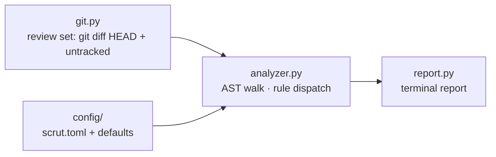

# scrut

**Review the Python you changed, not the Python you inherited.**

Scrut is a lightweight, Git-aware static analysis CLI for Python. It asks
Git which files your next commit will touch, parses each changed `.py`
file with the standard `ast` module, and reports structural problems
against limits you configure in `scrut.toml`.

No daemon. No network. No path lists to maintain. Run it in the seconds
before `git push`, fix what it flags, push.

```bash
pip install scrut
cd your-repo
scrut
```

---

## Table of contents

- [Why it exists](#why-it-exists)
- [Installation](#installation)
- [Quick start](#quick-start)
- [JSON output](#json-output)
- [GitHub Actions](#github-actions)
- [Configuration](#configuration)
- [Rules](#rules)
- [How it works](#how-it-works)
- [Repository layout](#repository-layout)
- [Adding a rule](#adding-a-rule)
- [Testing](#testing)
- [Roadmap](#roadmap)
- [FAQ](#faq)
- [Contributing](#contributing)
- [License](#license)

---

## Why it exists

- **The review set is the diff, not the repository.** Scrut computes the
  review set from Git at run time (`git diff HEAD --name-only` plus
  untracked files). Every finding is attributable to work you are about
  to push — never to the legacy you inherited.
- **Metrics are exact.** Parameter counts, nesting depth, and line spans
  come from the AST, not regex. If a metric cannot be computed exactly,
  Scrut does not claim it.
- **Errors are data.** An unreadable or syntactically broken file becomes
  an `ERROR` entry in the report. One broken file never cancels the
  review of the others.
- **Scrut reviews; it does not gate.** The exit code signals the outcome —
  `0` clean, `1` violations found, `2` Scrut error — but enforcement belongs
  in an opt-in interface, not in a tool you run before every push.
- **The runtime is the standard library.** Three `git` subprocess calls
  and
  `ast`/`tomllib`. No daemon to keep alive; runtime is bounded by the
  size of your diff, not your repository.

---

## Installation

Requires **Python 3.10+** (rules use `ast.Match`; configuration uses
`tomllib`) and **Git on `PATH`**.

```bash
pip install scrut
```

or from source:

```bash
git clone https://github.com/mukundzha/scrut.git
cd scrut
pip install -e .
```

Both register the `scrut` console script (`scrut.cli:main`).

---

## Quick start

The interface is one command with a small set of optional flags:

```bash
cd your-repo
# ... make a change ...
scrut            # human report
scrut --json     # one JSON document on stdout
scrut --docs     # built-in documentation; no review performed
scrut --version  # print the version and exit
scrut --verbose  # step-by-step review details on stderr
scrut --quiet    # analyze, print no report; exit code only
scrut --changed  # compact added/deleted view of changed files vs HEAD
scrut --staged   # review only files staged for the next commit
scrut --all-files  # review every eligible Python file, not just the diff
scrut --not-git  # review every eligible .py file on disk; no Git repo needed
scrut --help     # every flag
```

The review set is defined by Git, so there is nothing to configure at
invocation time. With `--not-git`, Scrut skips the Git requirement and
reviews every eligible `.py` file found by walking the current
directory instead (skipping Git, cache, and virtual-environment
directories). Scrut reviews:

- tracked files modified vs. `HEAD` (`git diff HEAD --name-only`), and
- untracked `.py` files (`git ls-files --others --exclude-standard`).

Deleted paths and non-`.py` files are skipped. Committed, untouched files
never appear in the output. Files that look generated
(`generated.py`, `*_generated.py`, `codegen.py`, `autogen.py`, … — see
`src/scrut/utility/is_generated.py`) are skipped too.

The review-scope flags `--changed`, `--staged`, and `--all-files` are
mutually exclusive — pick at most one. The output flags `--json`,
`--verbose`, and `--quiet` combine freely with any review scope.

### A run with findings

```text
$ scrut

scrut [Review Summary]
╔═════════════════════════════════════════╗
║ 🟡 2 warnings      │ 📊 2 funcs checked ║
╚═════════════════════════════════════════╝

[NEEDS REVIEW] ────────────────────────────────────────────────────────────

╭─ ⚠️ tests/bad.py (2)
│  Component  Kind  Rule                 Metric
│  ────────────────────────────────────────────
│  messy      func  Too many parameters     6/5

[PASSING] ─────────────────────────────────────────────────────────────────

✓ src/util.py
```

- **Summary box** — bold `scrut [Review Summary]` with per-severity
  counts. Segments appear only when non-zero: 🔴 errors, 🟡 warnings,
  🟢 passed files, 📊 functions checked.
- **Per-file sections** — each file under `[NEEDS REVIEW]` is headed by
  its name and finding count, flagged 🛑 when it contains an `ERROR`
  and ⚠️ otherwise.
- **Rows** — a `Component / Kind / Rule / Metric` table per file.
  Components are functions, classes, or `<file>`; kinds are `func`,
  `class`, `file`. Threshold rules render `measured/limit` (e.g. `6/5`);
  presence rules render `detected`. Identical `(component, rule)` rows
  are deduplicated per file — two findings on the same component and
  rule render once, as above.
- **Passing grid** — compliant files under `[PASSING]`, compressed to a
  few lines with a `[+N more]` note when there are many.

### A clean run

```text
$ scrut

scrut [Review Summary]
╔═══════════════╗
║ 🟢 All clean. ║
╚═══════════════╝
```

### Edge cases

```text
$ cd /tmp/somewhere-without-git
$ scrut
error: no Git repository found
hint: run Scrut from inside a Git repository

$ cd ~/fresh-checkout   # e.g. a CI runner
$ scrut
error: nothing to review
hint: nothing changed vs HEAD (CI checkouts are clean); use --all-files for a full review
```

Colors are ANSI codes emitted only when stdout is a TTY. Piped output is
plain, so `scrut | tee review.log` and CI capture work cleanly. Runtime
errors are written to stderr, so stdout stays clean for piping and
`--json` capture. The exit code is `0` when the review is clean, `1`
when findings are reported, and `2` when Scrut cannot run.

### Built-in documentation

`scrut --docs` prints terminal documentation derived from this codebase —
what Scrut does, the Git-aware workflow, every rule with its scope, every
configuration key with its default, both output formats, and realistic
examples — then exits `0` without running a review. It works anywhere,
even outside a Git repository. In a real terminal it opens as an
interactive browser (`H`elp, `G`o, `M`ain screen, `Q`uit); when stdout
is piped it prints the plain text instead.

---

## JSON output

For automation and CI, `--json` prints the review as a single JSON document
on stdout, with no human-readable text mixed in:

```bash
scrut --json
```

```json
{
  "version": 1,
  "tool": "scrut",
  "violations": [
    {
      "rule": "SCR014",
      "severity": "WARNING",
      "message": "Too many parameters (6/5). Group related parameters into a data class or dictionary.",
      "file": "buggy.py",
      "name": "extra",
      "kind": "func",
      "line": 4
    }
  ],
  "summary": {
    "total": 1,
    "errors": 0,
    "warnings": 1,
    "files_with_violations": 1
  }
}
```

Each violation carries the rule id (or a human-readable label when the
finding has none), its severity, the message, the file, the component name,
its kind (`func`, `class`, or `file`), and the line the finding refers to
(`null` for file-level findings) — the same component and kind shown in
the human table. `files_with_violations` is the number of distinct
files containing at least one violation.

The document is a stable, versioned contract for automation: `version`
is the schema version (independent of the Scrut package version), `tool`
identifies the emitter, and the same input always produces the same JSON
— no colors, timestamps, or diagnostics leak in. Exit codes behave
exactly as in normal mode, so `scrut --json` can gate CI: parse stdout
for the findings and react to the exit status (`0` clean, `1` violations,
`2` Scrut error).

---

## Quiet mode

`--quiet` runs the exact same analysis but prints no report; only the
exit code signals the outcome (`0` clean, `1` violations, `2` Scrut
error), which makes it fit hooks and scripts that need only the status.
Errors are never silenced: messages such as "error: no Git repository found" still print, `--json` still emits its document, and
`--verbose` diagnostics still go to stderr.

---

## GitHub Actions

Scrut can run as a GitHub Actions check on every pull request and push.

### Add Scrut to your pipeline

For an existing project, a minimal workflow installs the published package
and reviews the whole checkout on every PR and push:

```yaml
name: Scrut

on:
  pull_request:
  push:

jobs:
  scrut:
    runs-on: ubuntu-latest
    permissions:
      contents: read

    steps:
      - uses: actions/checkout@v6

      - uses: actions/setup-python@v5
        with:
          python-version: "3.12"

      - name: Install Scrut
        run: python -m pip install scrut

      - name: Run Scrut
        run: scrut --all-files --json
```

- `actions/checkout` puts the pull request's code in the runner's working
  tree — Scrut analyzes the files that checkout provided, nothing more.
- `actions/setup-python` provides a Python runtime; Scrut requires
  Python 3.10+.
- `python -m pip install scrut` installs the latest published release.
  Pin a version (`scrut==0.3.1`) for reproducible runs.
- `scrut --all-files --json` reviews every eligible `.py` file and prints
  the machine-readable document to the job log. `permissions: contents:
  read` is the only permission needed — the workflow makes no API calls.

### Why `--all-files`

The default review set is files changed vs. Git `HEAD`, so a freshly
checked-out working tree — clean by construction — has nothing to review:
`scrut` would print `error: nothing to review` and exit `2`. The same
applies to `--changed` and `--staged`; they only make sense locally,
against your own working tree. Whole-repository review is the mode that
works in CI:

| Command | Purpose | In CI |
|---------|---------|------|
| `scrut` | review files changed vs `HEAD` | empty set; don't use |
| `scrut --changed` | diff view of changed files | empty set; don't use |
| `scrut --staged` | review staged changes | empty set; don't use |
| `scrut --all-files` | review every eligible Python file | the CI mode |
| `scrut --json` | machine-readable document on stdout | combine with `--all-files` |
| `scrut --quiet` | suppress report; exit code only | fine for gating |

### Exit codes and failures

Scrut's exit code behaves in CI exactly as it does locally: `0` is clean,
`1` means findings were reported, `2` means Scrut could not run. GitHub
Actions fails a job when a step exits non-zero, so `--all-files --json`
fails the check on any finding, and the JSON document in the job log shows
why. Nothing is hidden with `|| true`; findings already present in the
repository fail the check until they are fixed or excluded with
`ignore_paths` in `scrut.toml`.

### The repository's own workflow

The Scrut repository itself ships `.github/workflows/scrut.yml`; enable it
in the repository's **Actions** tab and it runs on its own. It installs
the repository's own source with `pip install -e .`, so it tests the code
in the pull request rather than a published release, then reviews the
whole checked-out repository with `--all-files --json`.

---

## Other CI systems

Scrut is a plain console command with a documented exit code, so any CI
system can run it with the same three steps:

1. Install: `python -m pip install scrut`
2. Run: `scrut --all-files --json`
3. Treat the exit code as the result: `0` pass, `1` findings, `2` error.

The JSON document on stdout is stable and versioned (see [JSON
output](#json-output)), so it can be parsed for job annotations, summary
comments, or dashboards.

---

## Configuration

Configuration is optional, partial, and declarative. Scrut looks for a
`scrut.toml` in the **current working directory** and merges it over the
built-in defaults — any subset is valid. A malformed file raises instead
of being silently ignored.

```toml
[limits]        # numeric thresholds per rule
[rules]         # on/off toggle per rule
ignore_paths = ["tests", "migrations"]   # top-level: paths to skip
```

### Rule toggles

| Key | Default | Rule |
|-----|---------|------|
| `async_without_await` | `true` | SCR001 |
| `bare_except` | `true` | SCR002 |
| `max_boolean_conditions` | `true` | SCR003 |
| `detect_duplicateb` | `true` | SCR004 |
| `max_large_comprehensions` | `true` | SCR005 |
| `empty_except` | `true` | SCR006 |
| `max_if_else_chain` | `true` | SCR007 |
| `max_lambda_nodes` | `true` | SCR008 |
| `max_local_variables` | `true` | SCR009 |
| `max_class_lines` | `true` | SCR010 |
| `max_file_lines` | `true` | SCR011 |
| `max_function_lines` | `true` | SCR012 |
| `max_nesting` | `true` | SCR013 |
| `max_parameters` | `true` | SCR014 |
| `nested_function` | `true` | SCR015 |
| `max_return_statements` | `true` | SCR016 |
| `max_complexity` | `true` | function/class complexity |

Setting a toggle to `false` disables that rule's findings. A one-line
`[rules]` section is a complete, valid configuration.

### Limits

| Key | Default | Rule | Meaning |
|-----|---------|------|---------|
| `max_parameters` | 5 | SCR014 | Max positional + keyword params |
| `max_nesting` | 5 | SCR013 | Max block nesting depth |
| `max_function_lines` | 300 | SCR012 | Max function line span |
| `max_class_lines` | 200 | SCR010 | Max class line span |
| `max_file_lines` | 1000 | SCR011 | Max file line count |
| `max_complexity` | 40 | — | Max cyclomatic complexity |
| `max_boolean_conditions` | 5 | SCR003 | Max operands in one chain |
| `max_if_chain` | 5 | SCR007 | Max if/elif links in a chain |
| `max_local_variables` | 30 | SCR009 | Max distinct assigned names |
| `max_return_statements` | 6 | SCR016 | Max `return`s per function |
| `max_lambda_nodes` | 10 | SCR008 | Max AST nodes in a lambda body |
| `max_large_comprehensions` | 40 | SCR005 | Max AST nodes in a comprehension |

Limits are applied by key. A rule whose limit key is absent from the
merged config falls back to the limit hardcoded in its own module, so a
partial `[limits]` never turns a rule off. Every limit key in the table
above lives in `DEFAULT_LIMITS` and can be tuned from `scrut.toml`.

### Ignoring paths

Two mechanisms exclude files, both matching repository-relative paths
component-wise — `tests` skips `tests/` and `tests/x.py` but not
`tests.py`; a bare `"."` skips the whole repository:

- `scrut --ignore-path PATH` — repeatable CLI flag, or
- `ignore_paths = ["tests", "migrations"]` at the top level of
  `scrut.toml` (must be a list; anything else raises).

CLI and TOML paths are combined and de-duplicated before analysis.
Matching is purely string-based (`src/scrut/utility/is_ignored.py`) —
no filesystem access.

### Example

```toml
# scrut.toml — the exact file this repository lives by
[limits]
max_parameters          = 4
max_nesting             = 5
max_function_lines      = 50
max_class_lines         = 50
max_file_lines          = 50
max_complexity          = 10
max_boolean_conditions  = 6
max_local_variables     = 15
max_return_statements   = 6
max_lambda_nodes        = 10
max_large_comprehensions = 12

[rules]
max_parameters          = true
max_nesting             = false
max_function_lines      = false
max_class_lines         = true
max_file_lines          = true
max_complexity          = false
max_boolean_conditions  = true
max_local_variables     = true
max_return_statements   = true
max_lambda_nodes        = true
max_large_comprehensions = true
```

---

## Rules

Scrut ships 16 rule identifiers (SCR001–SCR016) plus two cyclomatic
complexity checks on functions and classes sharing the `max_complexity`
limit. Every rule finding is a `WARNING`; `ERROR` findings exist only for
files that cannot be read or parsed. Rules with a threshold render
`measured/limit`; presence-based rules render `detected`.

| ID | Rule | Limit | Scope | Metric |
|----|------|-------|-------|--------|
| SCR001 | Async without await | — | async funcs | `detected` |
| SCR002 | Bare except | — | funcs | `detected` |
| SCR003 | Boolean expression too complex | 5 | funcs, classes | `N/limit` |
| SCR004 | Duplicate branch | — | funcs | `detected` |
| SCR005 | Large comprehension | 10 | funcs | `N/limit` |
| SCR006 | Duplicate branch | — | funcs, classes | `detected` |
| SCR007 | Long if/elif chain | 5 | funcs, classes | `N/limit` |
| SCR008 | Lambda too complex | 5 | funcs | `N/limit` |
| SCR009 | Too many local variables | 15 | funcs | `N/limit` |
| SCR010 | Class too large | 200 | classes | `N/limit` |
| SCR011 | File too large | 400 | files | `N/limit` |
| SCR012 | Function too long | 50 | funcs | `N/limit` |
| SCR013 | Nesting too deep | 4 | funcs | `N/limit` |
| SCR014 | Too many parameters | 5 | funcs | `N/limit` |
| SCR015 | Nested function definition | — | funcs | `detected` |
| SCR016 | Too many return statements | 3 | funcs | `N/limit` |
| — | Function too complex | 10 | funcs | `N/limit` |
| — | Class too complex | 10 | classes | `N/limit` |

### SCR001 — Async without await

Flags `async def` functions that never `await`. An async function without
an `await` runs synchronously while still incurring event-loop overhead.
This is the only rule applied to `async def` functions; the other
function rules do not run on them.

```python
# bad
async def fetch_config():
    return json.load(open("config.json"))

# good
def fetch_config():
    return json.load(open("config.json"))
```

### SCR002 — Bare except

Flags `except:` handlers that catch every exception — including
`KeyboardInterrupt` and `SystemExit`.

```python
# bad
try:
    return json.loads(raw)
except:
    return None

# good
try:
    return json.loads(raw)
except (ValueError, TypeError):
    return None
```

### SCR003 — Boolean expression too complex

Flags a single `and`/`or` chain with too many operands. Nested chains sum
their operands, so `a and (b or c)` scores 3.

```python
# bad — 6 operands
if a and b and c and d and e and f:
    launch()

# good
if is_ready(a, b, c) and has_clearance(d, e, f):
    launch()
```

### SCR004 / SCR006 — Duplicate branch

Flags `if`/`elif` branches whose bodies are identical — a copy-paste or a
condition that never varies. The trailing `else` body is excluded from
the comparison. Two rule IDs cover the same detection:
SCR004 (`detect_duplicateb`) runs on functions; SCR006 (`empty_except`)
runs on functions and classes. Both emit the same finding, and the
report deduplicates identical rows, so one violation renders once.

```python
# bad
if kind == "csv":
    rows = read_csv(path)
elif kind == "json":
    rows = read_csv(path)      # copy-paste

# good
if kind in ("csv", "json"):
    rows = read_csv(path)
```

### SCR005 — Large comprehension

Flags list/set/dict comprehensions and generator expressions whose AST
node count exceeds `max_large_comprehensions` (default 10). Past a few
nested clauses a comprehension stops being an expression and becomes a
program.

```python
# bad
result = [
    [x * 100 for x in row if x != 0]
    for row in matrix
    if row and any(v > limit for v in row)
]

# good
def scale_row(row, factor):
    return [x * factor for x in row if x != 0]

result = [scale_row(row, 100) for row in matrix if row]
```

### SCR007 — Long if/elif chain

Flags if/elif chains longer than `max_if_chain` (default 5); the
trailing `else` clause does not add to the chain length.

```python
# bad
if status == "ok":
    ...
elif status == "warn":
    ...
elif status == "error":
    ...
elif status == "fatal":
    ...
elif status == "timeout":
    ...
else:
    ...

# good
status_actions = {"ok": ok_action, "warn": warn_action}
status_actions.get(status, unknown_action)()
```

### SCR008 — Lambda too complex

Flags `lambda` bodies exceeding `max_lambda_nodes` (default 5) AST nodes.

```python
# bad
transform = lambda v: v.strip().lower().split(",") if "," in v else [v]

# good
def transform(v):
    return v.strip().lower().split(",") if "," in v else [v]
```

### SCR009 — Too many local variables

Flags functions assigning more than `max_local_variables` (default 15)
distinct names — every new name is cognitive load and a chance for
shadowing. The count covers plain `x = ...` assignment targets only
(`ast.Assign` with `ast.Name` targets); augmented and unpacked
assignments are not counted. Assignments inside nested functions count
toward the enclosing function's total. Fix: extract groups of
assignments into helpers.

### SCR010 — Class too large

Flags classes whose line span exceeds `max_class_lines` (default 200).
A class past ~200 lines is usually several classes; fix by splitting by
responsibility.

### SCR011 — File too large

Flags files exceeding `max_file_lines` (default 400). Fix: split into
modules with single concerns.

### SCR012 — Function too long

Flags functions whose line span exceeds `max_function_lines` (default
50). Fix: extract helpers — `process_order` becomes `validate`,
`reserve`, and `send`.

### SCR013 — Nesting too deep

Flags maximum nesting depth of block nodes above `max_nesting` (default
4). Depth counts `if`, `for`, `while`, `async for`, `with`, `async
with`, `try`, and `match` only. Comprehensions, lambdas, and nested
`def`s do **not** add depth; sibling blocks do not stack — the metric is
maximum depth, not block count.

```python
# bad — 5 deep
with open(path) as f:               # 1
    for row in f:                   # 2
        if row.startswith("#"):     # 3
            try:                    # 4
                parse(row)          # 5

# good — early-return guards flatten it
def line_ready(row):
    if not row:
        return False
    if row.startswith("#"):
        return False
    return True

with open(path) as f:
    for row in f:
        if line_ready(row):
            parse(row)
```

### SCR014 — Too many parameters

Flags functions with more than `max_parameters` (default 5) positional or
keyword parameters. The count is `node.args.args`, so `*args` and
`**kwargs` are excluded; `self` on methods counts as a parameter.

```python
# bad
def connect(host, port, user, password, db, timeout):
    ...

# good
@dataclass
class Connection:
    host: str
    port: int
    user: str
    password: str
    db: str

def connect(cfg: Connection, timeout: int) -> None: ...
```

### SCR015 — Nested function definition

Flags a function defined inside another function. Closures that capture
their enclosing scope run once per outer call and defeat unit testing.
Only plain `def` definitions are flagged; a nested `async def` is not.

```python
# bad
def process_all(data):
    def normalize(value):
        return value.strip().lower()
    return [normalize(x) for x in data]

# good
def normalize(value):
    return value.strip().lower()

def process_all(data):
    return [normalize(x) for x in data]
```

### SCR016 — Too many return statements

Flags functions with more than `max_return_statements` (default 3)
`return`s — every exit point is a path to maintain. Returns inside
nested functions count toward the enclosing function's total.

### Function / Class too complex — cyclomatic complexity

Flags functions and classes whose McCabe cyclomatic complexity exceeds
`max_complexity` (default 10). Base 1, then +1 for every `if`, `for`,
`async for`, `while`, `try`, `except` handler, `match`, ternary,
`assert`, `with`, `async with`, and every `and`/`or` chain — an
`and`/`or` chain counts 1 regardless of how many operands it combines,
so `a and (b or c)` adds 2 (one per chain). The walk covers the whole
subtree: a class's complexity is the sum over its entire body, methods
included.

---

## How it works

The codebase is deliberately small: a CLI orchestrator, four pipeline
modules, two config modules, and one rule per file. The governing rule is
that **`cli.py` only orchestrates** — every function it calls lives in
another module, and nothing imports `cli.py`.



| Module | Role | Key exports |
|--------|------|-------------|
| `cli.py` | Pipeline wiring | `main()` |
| `docs.py` (in `utility/`) | Built-in `--docs` text | `DOCS` |
| `git.py` | Git interaction | `is_gitrepo`, `get_changed_files`, `get_staged_files`, `get_reviewable_files` |
| `analyzer.py` | AST analysis | `read_file`, `analyze_file` |
| `rules/*.py` | One rule per module | `analyze(node, limits)` |
| `report.py` | Terminal + JSON rendering | `render_report`, `generate_report`, `render_json` |
| `config/default.py` | Default limits | `DEFAULT_LIMITS` |
| `config/loader.py` | TOML load + merge | `load_config`, `merge_limits`, `merge_rules`, `DEFAULT_RULES` |

### Pipeline

1. `cli.main()` loads config (`limits` + `rules` merged over defaults).
2. `git.is_gitrepo()` — `git rev-parse --is-inside-work-tree`; exits the
   run with a message if not a repo.
3. `git.get_changed_files()` — `git diff HEAD --name-only` plus untracked
   files; `git.get_staged_files()` — `git diff --cached --name-only` — is
   used with `--staged`; `get_reviewable_files()` keeps existing `.py`
   paths that are neither generated (`is_generated`) nor covered by
   ignore paths (`is_ignored`); if none remain, prints a message and
   exits `2`.
4. Per file, `analyzer.analyze_file(path, limits, rules)`:
   - reads UTF-8 (`OSError` → `ERROR` report), parses with `ast.parse`
     (`SyntaxError` → `ERROR` report; the rest of the run continues),
   - walks the AST once with `ast.walk`, dispatching `FunctionDef`,
     `AsyncFunctionDef`, and `ClassDef` nodes to their rules (rule
     toggles are checked before dispatch, so disabled rules never run),
   - returns `(function_reports, file_reports, class_reports)`.
5. `report.render_report(...)` groups issues by file in a single pass
   and renders the `scrut [Review Summary]` box, `[NEEDS REVIEW]`
   component tables, and the `[PASSING]` grid.

`cli.py` with `--docs` short-circuits before config loading and calls
`docs.render_docs()`, so no Git or analysis code runs. In a TTY that
renders an interactive browser over `docs.DOCS`; piped stdout prints
the plain text.

### Reporting details

Terminal rendering is hand-rolled ANSI in `src/scrut/report.py` — the
`rich` dependency declared in `pyproject.toml` is not imported. Colors,
box-drawing characters, and emoji are emitted only when stdout is a TTY;
piped output is plain. Table columns are fitted to the terminal width
and long rule names truncate with `…`, so lines never wrap. Identical
`(component, rule)` rows are deduplicated per file, and file-level rows
sort first. The `[PASSING]` grid collapses to at most a few lines, with
a `[+N more]` note when it overflows. `SCRUT_FONT=name` is an opt-in
OSC 50 font switch honored only by capable terminals.

---

## Repository layout

```
scrut/
├── pyproject.toml          # packaging, console script
├── scrut.toml              # limits this repo lives by
├── src/scrut/
│   ├── cli.py              # entry point; orchestration only
│   ├── git.py              # review-set computation
│   ├── analyzer.py         # AST walk, rule dispatch
│   ├── report.py           # terminal report UI
│   ├── rules/              # one module per rule
│   │   ├── complexity.py           # cyclomatic metric (no issues itself)
│   │   ├── max_nesting.py          # get_depth + BLOCK_NODES
│   │   └── ...                     # one analyze(node, limits) per rule
│   ├── utility/
│   │   ├── docs.py         # --docs terminal documentation text
│   │   ├── is_generated.py # generated-file patterns
│   │   └── is_ignored.py   # ignore-path matching
│   └── config/
│       ├── default.py      # DEFAULT_LIMITS
│       └── loader.py       # load_config, merge_limits, merge_rules
└── tests/
    └── test_git.py         # 59 tests, incl. a real-git end-to-end run
```

---

## Adding a rule

A rule is a module in `src/scrut/rules/` exposing
`analyze(node, limits) -> list[issue]`, where an issue is:

```python
{"rule": "SCR017", "severity": "WARNING",
 "message": "Description (value/limit). Remediation guidance."}
```

Plus a `[rules]` toggle in `DEFAULT_RULES` (and a limit in
`DEFAULT_LIMITS` if the rule has a threshold). Wire the dispatch into
`analyze_file` with a toggle guard, then write the tests: one for the
violation, one for the boundary. The renderer displays any
`(severity, message)` pair it receives, so no report code changes.

---

## Testing

All 59 tests run in a fraction of a second — no network, no package
installs:

```bash
pip install -e .
python -m pytest tests/
```

Coverage includes the git helpers, config merging, every nesting block
type, every complexity decision point, boolean-chain measurement,
rule boundaries, analysis failure paths (unreadable/syntax-error files),
report output, the `--docs` flag (asserted to exit cleanly without
touching Git, inside or outside a repository), and an end-to-end run
against a **real temporary git repository** — Git itself is not mocked.
Mocking is limited to `subprocess.run` where a real Git isn't needed.

---

## Roadmap

Informed by documented limitations, ordered by the pain they remove:

**0.4 — Configuration hardening**
- Validate `scrut.toml` values with readable errors (today: a malformed
  file raises)
- Search upward from the working directory for `scrut.toml` (today: CWD
  only)

**1.0 — CI-grade interface**
- Configurable exit codes, so enforcement thresholds can be tuned without
  changing scrut's review-only default

New rules must survive the philosophy section — the ceiling is raised
deliberately, not by accretion.

---

## FAQ

**Why only changed files?**
Pre-existing issues are noise. A whole-repo run buries the few findings
you introduced under hundreds you didn't. The review set is the diff, so
the output is always relevant to the next push.

**Why `git diff HEAD` and not `git diff`?**
Plain `git diff` covers only unstaged changes. `HEAD` covers staged plus
unstaged — the complete set of files about to be pushed — and scrut adds
untracked files on top, so brand-new files are never missed.

**Why AST instead of regex?**
Regex cannot count parentheses across lines, measure nesting, or
distinguish a definition from a call. The AST answers structural
questions exactly for every valid Python file.

**What are the exit codes?**
Scrut returns `0` when the review is clean, `1` when findings are
reported, and `2` when Scrut cannot run. It still reviews rather than
gates — enforcement stays in whatever calls it — but CI can now react to
the outcome directly.

**Does it need a network or a daemon?**
No. Three `git` subprocess calls and the standard library. Runtime is
bounded by the size of your diff, not your repository.

---

## Contributing

- **Tests before code.** A fix that cannot be expressed as a failing test
  first is not a fix yet.
- **Keep the diff small.** A change that touches more than two modules
  needs a justification in the PR description.
- **The standard-library runtime is the contract.** No new runtime
  dependencies without a written case that survives the philosophy
  section.
- **The README is the spec.** If the behavior changed, the README changes
  in the same commit.

Setup:

```bash
git clone https://github.com/mukundzha/scrut.git
cd scrut
pip install -e .
python -m pytest tests/
```

---

## License

MIT — see `LICENSE`.
